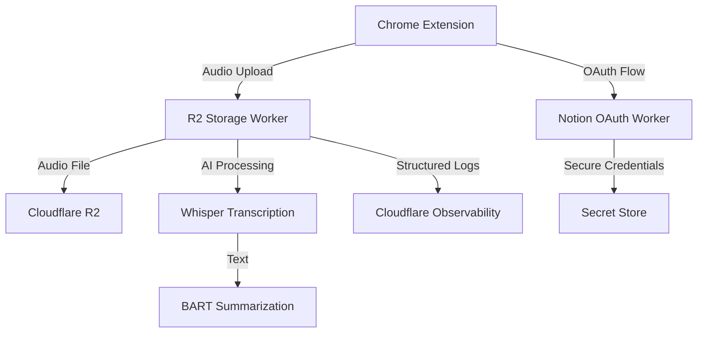

# Gist-Cloudflare
Gist Chrome extension built on Cloudflare Workers platform
A full-stack application that records audio from online courses, transcribes it using AI, and generates intelligent summaries. Built with Chrome Extensions, Cloudflare Workers, R2 storage, and modern AI services.

## 🎯 Project Overview

This project demonstrates a complete cloud-native architecture for audio processing and AI integration:

- Chrome Extension captures audio from browser tabs (courses, meetings, videos)
- Cloudflare Workers handle authentication, storage, and AI processing
- AI Services transcribe speech and generate summaries
- R2 Storage provides scalable cloud storage
- Secret Store manages credentials securely

## 🏗️ Architecture

## ⚡ Key Features

### 🎤 Audio Capture & Processing
- Record audio from any browser tab up to 8 minutes  
- Chunked upload system for reliable large file transfers  
- Background processing with Chrome service workers  
- WAV encoding with automatic compression  

### 🤖 AI-Powered Intelligence
- **Speech-to-Text:** Whisper-large-v3-turbo transcription  
- **Text Summarization:** BART-large-cnn for content compression  
- **Performance Analytics:** Processing times, compression ratios  
- **AI Gateway Integration:** Caching and optimization  

### 🔐 Modern Security
- **Secret Store:** Centralized credential management  
- **OAuth Integration:** Notion and Microsoft authentication  
- **CORS Handling:** Secure cross-origin requests  

### 📊 Observability & Monitoring
- **Structured JSON Logging:** Request tracking with unique IDs  
- **Performance Metrics:** Detailed timing for each operation  
- **Error Tracking:** Comprehensive debugging information  
- **Business Intelligence:** File sizes, compression ratios, success rates  

---

## 🛠️ Technologies Used

### Frontend
- **Chrome Extensions API** – Tab capture, background processing  
- **Web Audio API** – Audio encoding and processing  
- **Webpack** – Module bundling and optimization  

### Backend
- **Cloudflare Workers** – Serverless compute platform  
- **Cloudflare R2** – Object storage compatible with S3  
- **Secret Store** – Secure credential management  

### Workers AI
- **OpenAI Whisper** – Speech-to-text transcription  
- **Facebook BART** – Text summarization  
- **AI Gateway** – Request caching and analytics  

### DevOps & Monitoring
- **Structured Logging** – JSON-based observability  
- **Real-time Analytics** – Performance and usage metrics  
- **Error Tracking** – Comprehensive debugging  

---

## 📈 Performance Highlights
- 8-minute audio files processed reliably  
- Chunked uploads with 150KB segments  
- Sub-second transcription for most files  
- 70%+ compression ratios for summaries  

---

## 🎓 Learning Outcomes

This project showcases:
- Modern Cloud Architecture with serverless patterns  
- AI Integration for practical applications  
- Security Best Practices with secrets management  
- Browser Extension Development with advanced APIs  
- Observability and production monitoring  
- Performance Optimization for large file handling  

---

## 📖 Documentation

Each component includes detailed documentation:
- `./workers/r2-storage-worker/README.md` – AI processing pipeline  
- `./workers/notion-oauth-worker/README.md` – Authentication and security  
- `./chrome-extension/README.md` – Browser integration  

---

## 🤝 Contributing

This is a portfolio project demonstrating cloud-native development patterns.  
Feel free to explore the code and architecture decisions.

---

## 📄 License

MIT License – See `./LICENSE` for details.

