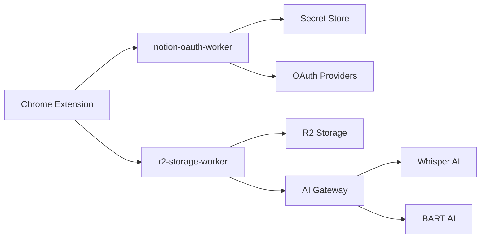

# Workers Overview

This directory contains **Cloudflare Workers** that power the backend infrastructure for the **Gist AI note-taking application**.  
These serverless functions handle **authentication, AI processing, file storage, and observability**.

---

## 🏗️ Worker Architecture

## 📁 Workers Structure

### 🔐 `./notion-oauth-worker/`

**Purpose:** Authentication and credential management  

**Key Features:**
- Secret Store integration for secure credential management  
- Multi-platform OAuth (Notion + Microsoft OneNote)  
- CORS handling for Chrome extension requests  
- Comprehensive error logging and debugging  

---

### 🤖 `./r2-storage-worker/`

**Purpose:** AI processing and file storage  

**Key Features:**
- Audio file upload and storage in **Cloudflare R2**  
- AI-powered transcription using **Whisper-large-v3-turbo**  
- Text summarization with **BART-large-cnn**  
- Structured JSON logging for observability  
- Performance analytics and compression metrics  

---

### 🔧 Shared Technologies

#### Core Platform
- **Cloudflare Workers** – Serverless compute platform  
- **Wrangler CLI** – Local Deployment and development tools  

#### Storage & Security
- **Cloudflare R2** – S3-compatible object storage  
- **Secret Store** – Centralized credential management  

#### AI & Processing
- **AI Gateway** – Request routing, caching, and analytics  
- **OpenAI Whisper** – Speech-to-text transcription  
- **Facebook BART** – Text summarization  
- **Binary Processing** – Audio encoding and file handling  

#### Observability
- **Structured Logging** – JSON-formatted logs  
- **Request Tracking** – Unique request IDs for debugging  
- **Performance Metrics** – Timing and compression analytics  
- **Error Handling** – Comprehensive exception tracking  

#### External Services
- **Notion API** – Note creation & workspace integration  
- **Microsoft Graph** – OneNote support  
- **OpenAI Services** – via Cloudflare AI Gateway  
- **Facebook AI** –  via Cloudflare AI Gateway  

---
## 📊 Performance & Monitoring

### 🔄 Request Flow
1. **Authentication** – OAuth worker validates and exchanges tokens  
2. **File Upload** – Audio files stored directly in the **R2 bucket**  

---

### 🔎 Observability Features
- **End-to-End Request Tracing** – Each request tagged with a unique UUID  
- **Business Analytics** – File sizes, compression ratios, and success rates  
- **Error Tracking** – Detailed stack traces for easier debugging  

## 🔐 Security Features

### Secret Management
- **Centralized credential storage** in Secret Store  
- **No hardcoded secrets** – all sensitive data managed securely  

### Authentication
- **OAuth 2.0 flows** for Notion and OneNote  
- **Strict CORS configuration** for Chrome extension origins  

